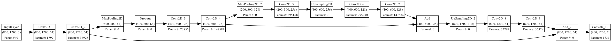
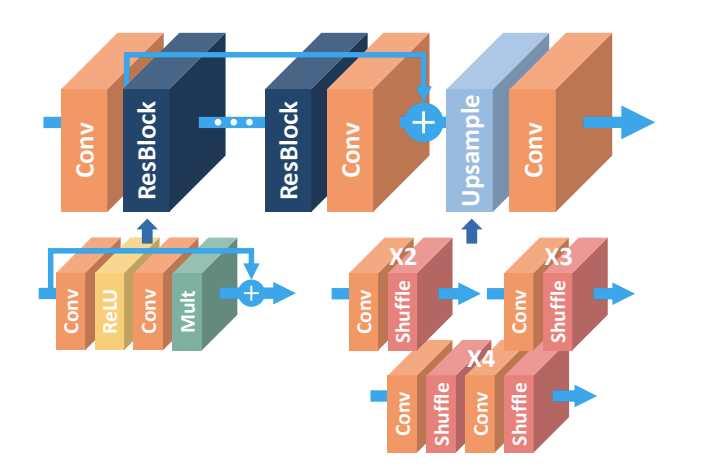
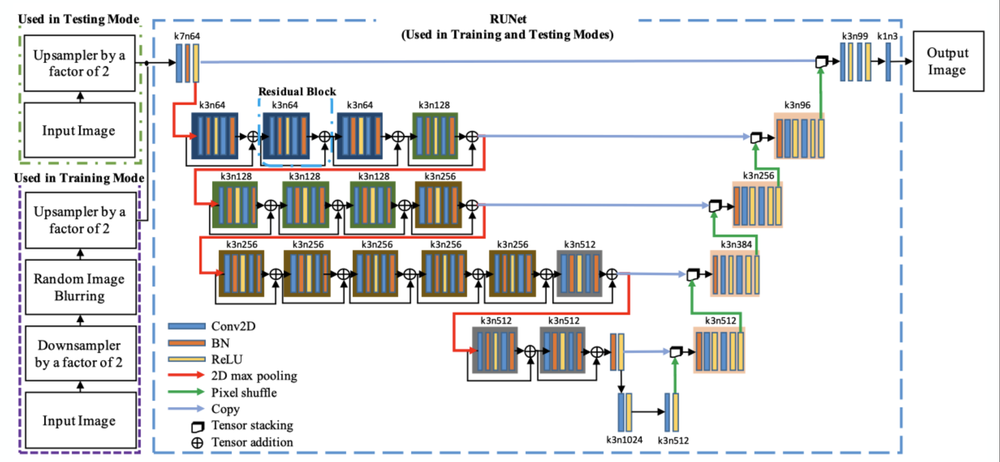
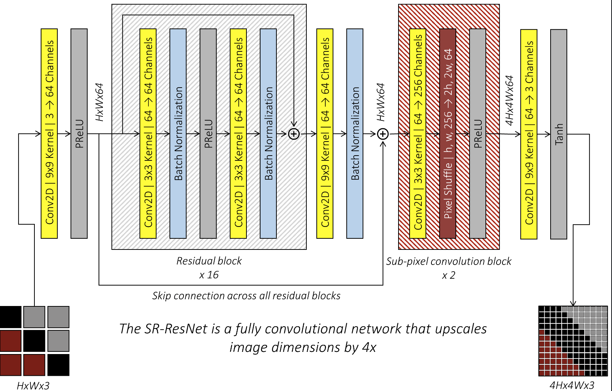
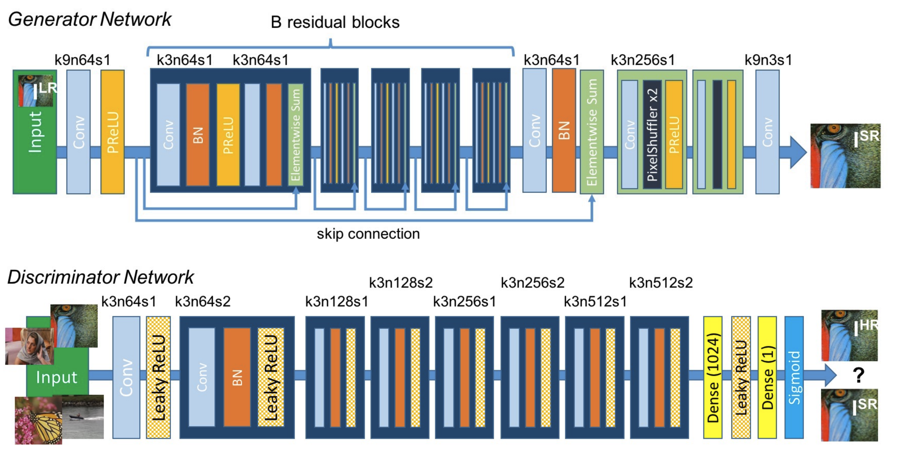

# Super Resolution Models from Simple to Advanced

Compiled code of many super resolution models, starting from simple to more advanced architectures. All models trained on MSCOCO 2017 data.

## Model Progression
1. Autoencoder
2. ResNet
3. UNet
4. SRResNet
5. SRGAN

## Good Papers to Read from Simple to Advanced
- [Deep Residual Learning for Image Recognition](https://arxiv.org/pdf/1512.03385)
- [U-Net: Convolutional Networks for Biomedical Image Segmentation](https://arxiv.org/pdf/1505.04597)
- [Real-Time Single Image and Video Super-Resolution Using an Efficient Sub-Pixel Convolutional Neural Network](https://arxiv.org/pdf/1609.05158)
- [Enhanced Deep Residual Networks for Single Image Super-Resolution](https://arxiv.org/pdf/1707.02921)
- [Perceptual Losses for Real-Time Style Transfer and Super-Resolution](https://arxiv.org/pdf/1603.08155)
- [Photo-Realistic Single Image Super-Resolution Using a Generative Adversarial Network](https://arxiv.org/pdf/1609.04802)

## Architecture Diagrams

### Autoencoder:

### ResNet:

### UNet

### SRResNet

### SRGAN

## Sources
### Autoencoder
- [Kaggle: Image Super-Resolution using Autoencoders](https://www.kaggle.com/code/quadeer15sh/image-super-resolution-using-autoencoders)
- [GitHub: Image Super-Resolution using Autoencoders](https://github.com/ilopezfr/image-superres/blob/master/Image_Super_Resolution_using_Autoencoders.ipynb)
- [Medium: Super Resolution using Autoencoders and TF2.0](https://medium.com/analytics-vidhya/super-resolution-using-autoencoders-and-tf2-0-505215c1674)

### ResNet
- [Enhanced Deep Residual Networks for Single Image Super-Resolution](https://arxiv.org/pdf/1707.02921)

### UNet
- [Cedrick Chee: Knowledge Courses](https://cedrickchee.gitbook.io/knowledge/courses/fast.ai/deep-learning-part-2-cutting-edge-deep-learning-for-coders/2018-edition/lesson-14-image-segmentation)
- [Towards Data Science: Deep Learning Based Super-Resolution Without Using a GAN](https://towardsdatascience.com/deep-learning-based-super-resolution-without-using-a-gan-11c9bb5b6cd5)
- [GitHub: Super Resolution DNN](https://github.com/cerniello/Super_Resolution_DNN)

### SRResNet
- [Photo-Realistic Single Image Super-Resolution Using a Generative Adversarial Network](https://arxiv.org/pdf/1609.04802)
- [GitHub: A PyTorch Tutorial to Super-Resolution](https://github.com/sgrvinod/a-PyTorch-Tutorial-to-Super-Resolution)

### SRGAN
- [Photo-Realistic Single Image Super-Resolution Using a Generative Adversarial Network](https://arxiv.org/pdf/1609.04802)
- [GitHub: A PyTorch Tutorial to Super-Resolution](https://github.com/sgrvinod/a-PyTorch-Tutorial-to-Super-Resolution)